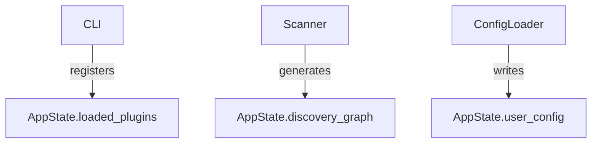

# 📦 CapGate State Management — `AppState`

## Module: `core/state_management/state.py`

### Purpose

Maintains a centralized and persistent representation of application-wide data such as plugins, discovery graphs, and user settings. Acts as the single source of truth for long-lived data shared across CapGate tools.

---

## 📐 Structure

### Class: `AppState`

A singleton object accessed via `get_state()`.

#### Attributes

| Name              | Type                       | Description                               |
| ----------------- | -------------------------- | ----------------------------------------- |
| `loaded_plugins`  | `List[str]`                | List of plugin names registered in app.   |
| `discovery_graph` | `Optional[Dict[str, Any]]` | Current or cached network map.            |
| `user_config`     | `Dict[str, Any]`           | Loaded configuration or session settings. |

#### Methods

| Name               | Returns                                                                 | Description                                  |
| ------------------ | ----------------------------------------------------------------------- | -------------------------------------------- |
| `to_dict()`        | `Dict[str, Union[List[str], Optional[Dict[str, Any]], Dict[str, Any]]]` | Export current state for serialization.      |
| `save_to_file()`   | `None`                                                                  | Save current state as a UTF-8 JSON file.     |
| `load_from_file()` | `None`                                                                  | Load state from an existing UTF-8 JSON file. |

#### Accessor

```python
from capgate.core.state_management.state import get_state
state = get_state()
```

---

## 🔄 Usage Cycle



---

## ✅ Developer Notes

* Always use `get_state()` to access the singleton.
* Don’t instantiate `AppState` directly.
* Supports future expansion (e.g., persistent storage, snapshots).
* Designed to work seamlessly with `CapGateContext`.

---

## 🔗 Related Modules

* `core/state_management/context.py` — runtime-scoped metadata handler
* `core/plugin_loader.py` — registers to `loaded_plugins`
* `vision/topology_discovery.py` — populates `discovery_graph`
* `cli/config_loader.py` — sets `user_config`
